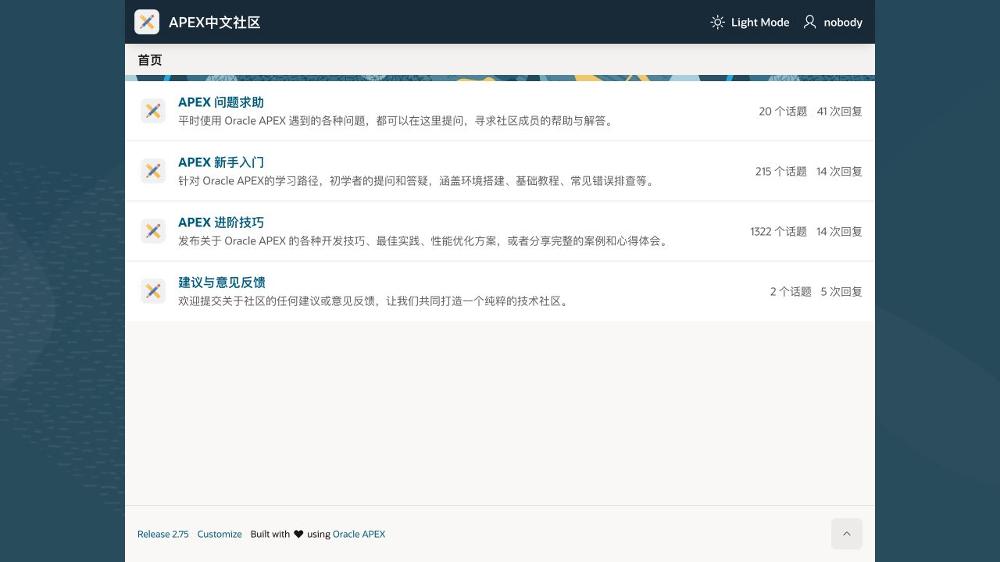
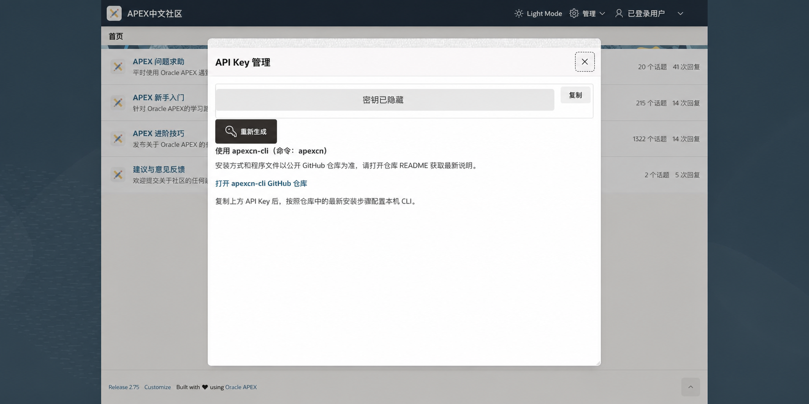

# apexcn-cli

`apexcn-cli` 是连接本地 AI 助手与 [APEX 中文社区](https://oracleapex.cn/) 的工具。

安装后，你不必记命令，也不必在网页之间反复查找和复制内容。直接告诉 AI 你想做什么，它就可以帮你：

- 搜索和总结 APEX 中文资料；
- 阅读帖子并整理排查步骤、学习笔记或检查清单；
- 根据社区内容回答问题，并附上可核对的帖子链接；
- 起草提问、回复或修改内容，等你确认后再执行；
- 收藏、订阅和整理对自己有用的帖子。

第一次使用只需三步：**安装 apexcn-cli → 获取社区 API Key → 把 Key 加入 apexcn-cli**。

## 第一步：一键安装 apexcn-cli

### 推荐：让 AI 帮你安装

把下面这句话发给你正在使用的本地 AI 助手：

> 请帮我一键安装 apexcn-cli。安装完成后检查版本是否可用。安装命令不接收 API key，也不要向我索取 API key。

### 也可以自己安装

macOS / Linux：

```bash
bash -o pipefail -c 'curl -fsSL https://github.com/wfg2513148/apexcn-cli/releases/latest/download/install-agent.sh | bash'
```

Windows PowerShell：

```powershell
irm "https://github.com/wfg2513148/apexcn-cli/releases/latest/download/install-agent.ps1" | iex
```

安装命令不接收 API key。安装程序会检查电脑上是否已有 Node.js 20 或更高版本；如果缺少，请让 AI 帮你安装 Node.js 后再执行一次。

## APEX 中文社区是什么

`apexcn-cli` 使用的内容来自 APEX 中文社区。这里汇集了 Oracle APEX 开发者分享的问题解答、入门教程、进阶技巧和实践经验。

你仍然可以直接打开社区网页阅读和交流；`apexcn-cli` 的作用，是让 AI 帮你更快地找到、理解和使用这些内容。



社区主要包含以下板块：

- **APEX 问题求助**：提交开发中遇到的问题，寻找社区帮助；
- **APEX 新手入门**：查找环境搭建、基础教程和常见问题；
- **APEX 进阶技巧**：查找开发技巧、最佳实践和完整案例；
- **建议与意见反馈**：向社区提出建议或反馈问题。

## 如何获取 API Key

API Key 用来确认 `apexcn-cli` 正在以你的社区账号访问内容。请按下面的步骤获取：

1. 打开 [APEX 中文社区](https://oracleapex.cn/)；
2. 点击右上角的 `nobody`，注册新账号或登录已有账号；
3. 登录后打开右上角账号菜单，选择 **API Key 管理**；
4. 在弹窗中点击 **复制**。



弹窗中的 **重新生成** 会立即撤销旧 Key。只有在 Key 丢失、疑似泄露或需要更换时才点击它。

API Key 和密码一样重要。不要把它发到帖子、聊天记录或 issue 中，也不要在截图里保留完整 Key。

## 把 API Key 加入 apexcn-cli

打开本机终端，先把下面命令中的 `YOUR_API_KEY` 整体替换成刚刚复制的真实 Key，再执行：

```bash
apexcn -apikey "YOUR_API_KEY"
```

普通字母和数字组成的 Key 也可以不加引号：

```bash
apexcn -apikey xxxxxx
```

不要直接照抄 `YOUR_API_KEY` 或 `xxxxxx`，它们只是占位示例。配置完成后，用下面的命令检查当前账号：

```bash
apexcn me
```

能看到自己的社区账号信息，就说明安装和配置已经完成。以后通常只需向 AI 说出需求，不必自己输入 `apexcn` 命令。

发布、修改或删除内容时，AI 会先展示业务内容并取得一个操作编号。只有在你明确确认后，它才会用这个编号执行刚才预览的同一项操作；编号过期、内容变化或账号切换后都不能继续使用。

## 遇到问题怎么办

如果 AI 没有识别 `apexcn-cli`，先重启 AI 工具，然后对它说：

> 请检查 apexcn-cli 是否安装成功，并确认当前账号、社区板块和搜索功能是否可用。不要输出完整 API Key。

如果仍然无法使用，可查看：

- [用户手册（中文）](docs/user-guide.zh.md)
- [User Guide (English)](docs/user-guide.en.md)
- [命令行终端手册](docs/cli-manual.zh.md)
- [Terminal Manual (English)](docs/cli-manual.en.md)
- [安全模型](docs/security-model.md)

## Top 20 典型使用话术

以下内容可以直接发给 AI。涉及发布、修改或删除时，建议保留“先预览、等我确认”的要求。

1. **搜索入门资料**

   > 请在 APEX 中文社区搜索适合初次学习 APEX 的入门帖子，挑选 5 篇，按阅读顺序排列并附上真实链接。

2. **搜索具体问题**

   > 请搜索 APEX 调用 REST API 返回 401 的相关帖子，按相关程度排序，并告诉我每篇可能解决什么问题。

3. **查找代码示例**

   > 请在 APEX 中文社区查找 JSON_TABLE 的入门示例，整理关键代码、使用条件和原帖链接。

4. **了解社区近期内容**

   > 请总结最近 7 天 APEX 中文社区的新内容，按新手入门、问题求助和进阶技巧分类。

5. **总结指定帖子**

   > 请打开社区帖子 30549，总结主要内容、操作步骤、注意事项和真实链接。

6. **判断帖子是否适用**

   > 请阅读这个社区帖子，并判断它能否解决我在 APEX 中拿不到 REST API 返回 JSON 的问题，说明理由和仍需确认的地方。

7. **比较多篇帖子**

   > 请比较这 3 篇帖子给出的解决方法，列出共同点、差异、适用版本和各自风险。

8. **根据社区内容回答问题**

   > 请根据 APEX 中文社区已有内容回答“Oracle APEX 如何调用 REST API”，并为每个关键结论附上参考帖子链接。

9. **整理排查清单**

   > 请根据社区帖子整理一份 ORDS 认证失败排查清单，按最容易检查到最深入的顺序排列。

10. **制定学习路线**

    > 请为初次接触 APEX 的开发者制定一条从页面开发到调用 REST API 的学习路线，并为每个阶段推荐社区帖子。

11. **整理个人学习笔记**

    > 请把这些帖子整理成学习笔记，每篇写清楚适合谁看、解决什么问题、关键步骤和原帖链接。

12. **查看当前账号**

    > 请检查 apexcn-cli 当前登录的是哪个社区账号。不要显示完整 API Key。

13. **了解发帖板块**

    > 请列出 APEX 中文社区的板块，并根据我的问题推荐最适合发帖的板块，说明原因。

14. **起草求助帖**

    > 我在 APEX 调用 REST API 时遇到 401。请先搜索社区已有讨论，再帮我起草一篇求助帖。先给我预览，不要发布。

15. **完善问题描述**

    > 请把我的问题整理成一篇清楚的社区帖子，包含环境、操作步骤、实际结果、期望结果、报错信息和已尝试方法。

16. **发布已确认的帖子**

    > 请把我确认后的内容发布到合适的社区板块。发布前再次显示标题、正文、板块和标签，等我确认后再执行。

17. **起草友好回复**

    > 请为帖子 30549 起草一条友好的回复，说明我的解决方法并补充必要步骤。先预览，不要发布。

18. **回复已有回复**

   > 请回复帖子 30549 中编号为 201480 的回复，补充我的测试结果。先确认它属于这个帖子，再给我预览，等我确认后发布。

19. **删除本人回复**

   > 请查找我编号为 201480 的回复，确认它属于当前账号并允许删除。先显示内容和真实链接，等我确认后按安全流程删除。

20. **自动诊断使用问题**

    > apexcn-cli 好像不能用了。请检查安装位置、版本、登录状态、社区板块和搜索功能，告诉我失败在哪一步，不要输出完整 API Key。
