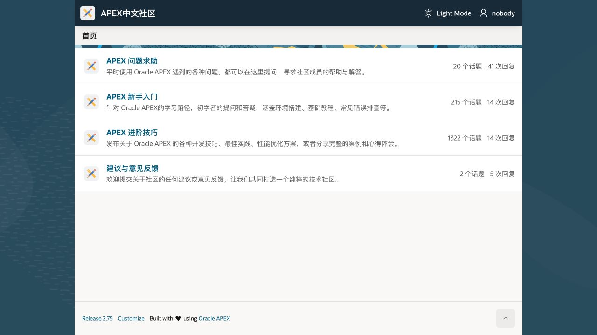
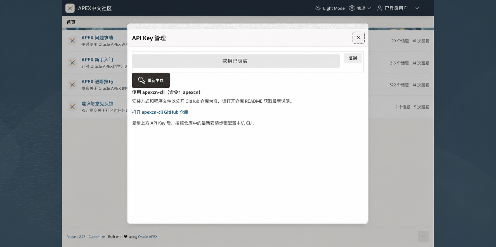

# apexcn-cli

让你正在使用的本地 AI 助手，更方便地访问和操作 [APEX 中文社区](https://oracleapex.cn/)。

安装并绑定社区 API Key 后，你只需要用自然语言告诉 AI 想做什么，不必记住一长串命令，也不必在网页、聊天窗口和终端之间反复复制内容。

## 它能帮你做什么

- **查资料**：搜索社区话题、查看近期内容、阅读完整讨论，并让 AI 归纳重点和操作步骤。
- **问问题**：基于社区现有内容回答 Oracle APEX 问题，同时给出可核对的参考话题。
- **管理个人内容**：查看我创建的、我回复的、我收藏的和我订阅的内容，并只在个人看板范围内搜索。
- **参与社区交流**：起草、发布、修改或删除话题与回复，收藏、订阅，以及在有权限时标记正确答案。
- **保留来源**：结果会显示完整话题标题和可直接打开的社区页面；转载内容还会单独显示原文链接。

涉及发布、修改、删除、收藏、订阅或标记答案时，`apexcn-cli` 会先让 AI 展示预览。只有你明确确认后，才会执行刚才看到的那项操作。

## 三步开始使用

### 1. 安装

最简单的方式，是把下面这句话发给你的本地 AI 助手：

> 请帮我安装 apexcn-cli。安装完成后检查版本是否可用。安装阶段不要向我索取 API Key。

也可以自己打开终端安装。

macOS / Linux：

```bash
bash -o pipefail -c 'curl -fsSL https://github.com/wfg2513148/apexcn-cli/releases/latest/download/install-agent.sh | bash'
```

Windows PowerShell：

```powershell
irm "https://github.com/wfg2513148/apexcn-cli/releases/latest/download/install-agent.ps1" | iex
```

安装命令不接收 API key，认证只在安装成功后单独配置。

安装程序需要 Node.js 20 或更高版本。如果电脑中没有合适版本，可以让 AI 先帮助安装 Node.js，再重新执行安装命令。

安装完成后，安装器会显示当前版本，并给出适用于本机安装位置的升级、回滚和卸载命令。需要时直接复制安装器显示的命令即可。

### 2. 获取社区 API Key

API Key 用来确认 `apexcn-cli` 正在以你的社区账号访问内容：

1. 打开 [APEX 中文社区](https://oracleapex.cn/)；
2. 注册或登录账号；
3. 打开右上角账号菜单，选择 **API Key 管理**；
4. 点击 **复制**。

API Key 和密码一样重要。不要把它贴到帖子、聊天记录、GitHub issue 或截图中。

### 3. 绑定 API Key

如果你希望步骤最少，请在自己的终端中执行下面的命令，并把示例文字替换成刚刚复制的真实 Key：

```bash
apexcn -apikey "YOUR_API_KEY"
apexcn auth audit
```

`YOUR_API_KEY` 只是占位文字，不能原样使用。因为终端可能保留命令历史，公共电脑或更重视安全的场景建议使用环境变量方式：

```bash
export APEXCN_API_KEY="YOUR_API_KEY"
apexcn auth set-token --token-env APEXCN_API_KEY
apexcn auth audit
```

Windows PowerShell：

```powershell
$env:APEXCN_API_KEY="YOUR_API_KEY"
apexcn auth set-token --token-env APEXCN_API_KEY
apexcn auth audit
```

最后可以让 AI 验证：

> 请检查 apexcn-cli 当前登录的是哪个社区账号，并确认搜索功能可用。不要显示完整 API Key。

## APEX 中文社区是什么

APEX 中文社区汇集了 Oracle APEX 用户分享的问题解答、入门教程、进阶技巧和实践经验。你仍然可以直接打开社区网页阅读和交流；`apexcn-cli` 的作用，是让本地 AI 帮你更快地找到、理解和使用这些内容。



常见内容包括：

- **问题求助**：查找相似问题或向社区描述自己的问题；
- **新手入门**：了解环境搭建、基础功能和常见操作；
- **进阶技巧**：阅读开发技巧、最佳实践和完整案例；
- **建议与反馈**：提出社区使用建议或反馈问题。

## 如何获取 API Key

登录社区后，在账号菜单中打开 **API Key 管理**，即可复制当前 Key。



弹窗中的 **重新生成** 会立即撤销旧 Key。只有在 Key 丢失、疑似泄露或确实需要更换时才使用。

如果忘记绑定方法，直接运行：

```bash
apexcn auth --help
```

帮助信息会同时显示最简单的绑定方式、更安全的环境变量方式和验证命令。

## 可以直接对 AI 这样说

### 查找和理解资料

> 请在 APEX 中文社区搜索“ORDS 认证失败”，总结最相关的 5 篇话题，并显示完整标题、社区链接和原文链接。

> 请告诉我最近 7 天有哪些新话题，按板块分类，并概括每篇适合解决什么问题。

> 请根据社区现有内容回答“Oracle APEX 如何调用 REST API”，为关键结论附上对应话题标题和链接。

### 使用个人看板

> 打开我的个人看板，分别显示我创建的、我回复的、我收藏的和我订阅的内容。

> 只在我收藏和订阅的内容中搜索 ORDS，不要搜索整个社区。

### 参与社区

> 请先搜索是否已有相似讨论，再帮我起草一篇关于 APEX 调用 REST API 返回 401 的求助帖。先给我预览，不要发布。

> 请回复刚才选中的话题，补充我的测试结果。先显示目标话题和回复内容，等我确认后再发布。

> 请把刚才选中的回复标记为正确答案。先检查我是否有权限并显示预览，等我确认后执行。

> 请收藏这个话题并订阅后续更新。执行前先让我确认目标内容。

帖子和回复编号应从实际搜索结果或你的个人内容中选择，不要把示例编号当作当前线上内容。

更多可直接复制的话术见 [中文用户手册](docs/user-guide.zh.md)。

## 链接和参考来源

当结果对应社区中的话题、回复、收藏或订阅内容时，CLI 会使用社区现有网页地址，不会另外制作一套重复页面。

- 需要校验信息的社区链接由社区系统直接提供，点击后可打开对应页面；
- 转载内容的 **社区页面** 和 **原文链接** 会分别显示；
- AI 引用资料时应显示完整话题标题，而不是只显示 `S1`、`S4` 之类的内部编号；
- 部分个人页面需要先在浏览器中登录社区。CLI 的 API Key 登录不会自动替代浏览器登录。

## 安全边界

- 搜索、阅读和总结只会读取内容；
- 发布、修改、删除、收藏、订阅和标记答案会先预览，再等待明确确认；
- 预览后如果内容、账号或目标状态发生变化，需要重新预览；
- CLI 不会要求你把 API Key 发布到社区或提交到 GitHub；
- `apexcn-cli` 是社区访问工具，不是 Oracle 官方产品。

## 遇到问题

可以先对 AI 说：

> apexcn-cli 好像不能用了。请检查安装版本、API Key 配置、当前账号、社区连接和搜索功能，告诉我失败在哪一步。不要输出完整 API Key。

也可以在终端运行：

```bash
apexcn doctor
```

进一步资料：

- [用户手册（中文）](docs/user-guide.zh.md)
- [User Guide (English)](docs/user-guide.en.md)
- [命令行终端手册](docs/cli-manual.zh.md)
- [Terminal Manual (English)](docs/cli-manual.en.md)
- [安全说明](docs/security-model.md)
