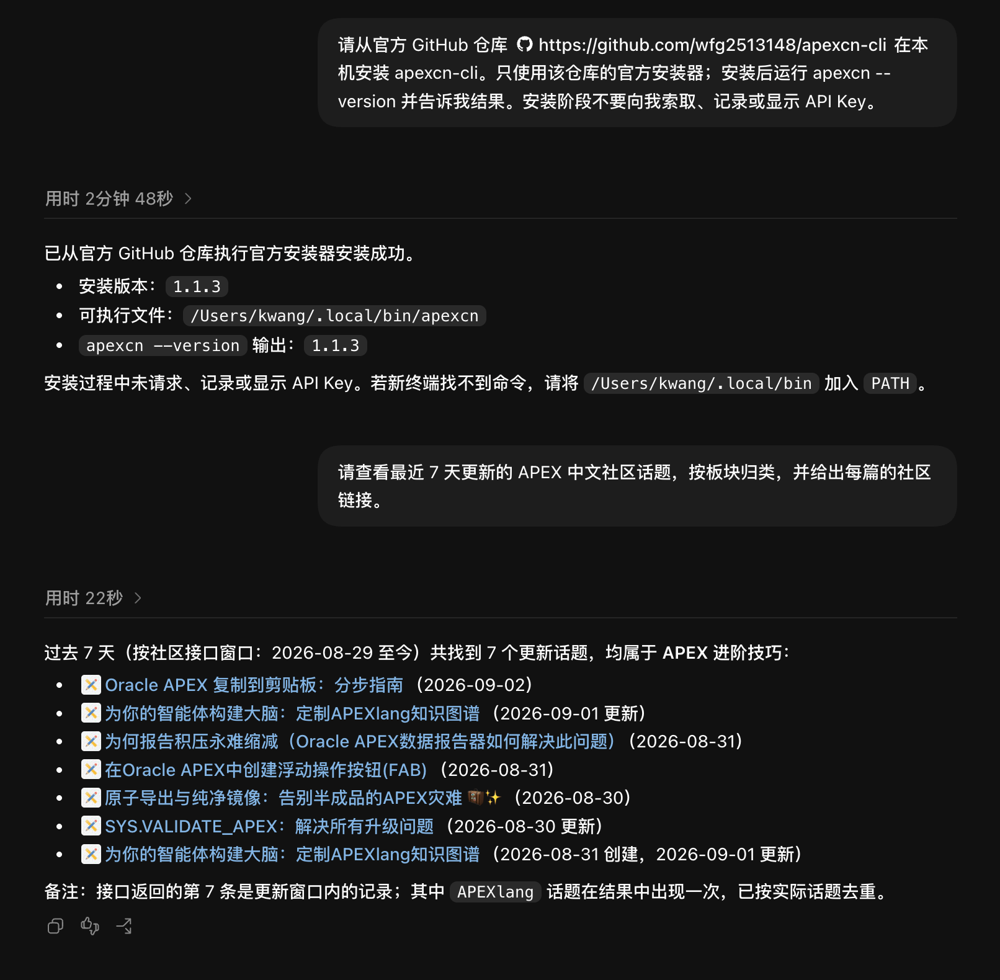
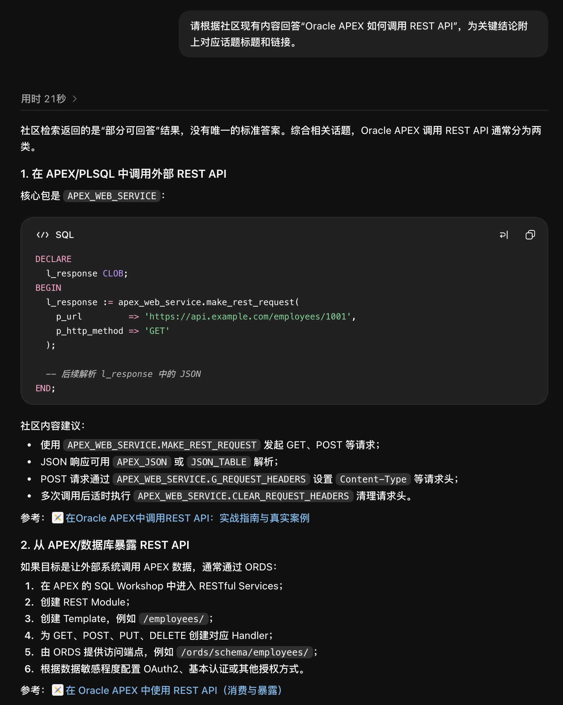

# apexcn-cli

**English** | [简体中文](README.zh-CN.md)

Explore the [APEX Chinese Community](https://oracleapex.cn/) from your terminal or local AI assistant. Find Oracle APEX discussions, read available English article editions, and turn community knowledge into answers with sources you can check.

[Get started](#get-started) · [Examples](#put-it-to-work) · [Language support](#chinese-and-english-content) · [English user guide](docs/user-guide.en.md) · [Command reference](docs/cli-manual.en.md)

## Meet the APEX Chinese Community

The APEX Chinese Community at **oracleapex.cn** is a community resource for Oracle APEX developers. It brings together questions and answers, beginner tutorials, development techniques, practical experiences, and collected articles with links to their original sources.

You can browse and participate on the website, or use `apexcn-cli` to bring that material into your development workflow. Developers outside the Chinese-speaking community can search in English, request available English article editions, and ask an AI assistant to explain relevant discussions in their preferred language.

The community and CLI are community projects, not official Oracle products. Content language varies: articles may have Chinese and English editions, while ordinary posts and replies retain the author's original text. See [language support](#chinese-and-english-content) before you start.


## Why use the CLI?

| What you want to do | How apexcn-cli helps |
| --- | --- |
| Solve an APEX or ORDS problem | Search discussions, read details, and retrieve evidence for an AI-assisted explanation. |
| Keep up with community activity | Browse recently updated topics and ask your assistant for a reading digest. |
| Check an answer's sources | Open the community topic and, for collected articles, the original source when available. |
| Reuse useful discussions | Search your own created, replied-to, favorited, or subscribed content. |
| Join a discussion | Draft a question or reply, review a preview, then confirm the action. |
| Build a repeatable workflow | Use structured JSON results in local scripts and AI tools. |

There are two ways to get an answer: `rag retrieve` supplies community evidence for **your local AI** to synthesize; `ask` requests an answer from the **community's server-side service**. Both support source-aware workflows. Check the cited content and its applicable APEX version before using a solution.

## Get started

You need **Node.js 20 or later**. Installers are available for macOS, Linux, and Windows. For account-based community access, sign in on the website and obtain your API key. A local AI tool is optional; it must be able to execute commands to operate the CLI for you.

### 1. Install from the official repository

Ask your local AI assistant, such as Codex:

> Install apexcn-cli on this computer from https://github.com/wfg2513148/apexcn-cli using its official installer. Run `apexcn --version` afterward. Do not request, record, or display my API key during installation.

Or install in your terminal.

**macOS / Linux:**

```bash
bash -euo pipefail -c 'tmp="$(mktemp)"; trap "rm -f \"$tmp\"" EXIT; curl -fsSL -o "$tmp" https://github.com/wfg2513148/apexcn-cli/releases/latest/download/install-agent.sh; bash "$tmp"'
```

**Windows PowerShell:**

```powershell
irm "https://github.com/wfg2513148/apexcn-cli/releases/latest/download/install-agent.ps1" | iex
```

The official repository is [wfg2513148/apexcn-cli](https://github.com/wfg2513148/apexcn-cli). The installer installs the CLI and its agent skill for supported local tool directories. AI tools differ in how they discover skills; see the [user guide](docs/user-guide.en.md) if you need to operate it manually.

```bash
apexcn --version
```

### 2. Connect your community account

Sign in at [oracleapex.cn](https://oracleapex.cn/), open the account menu, and select **API Key Management** (Chinese label: **API Key 管理**). Copy your key.

Run the following in your own terminal, replacing the placeholder:

```bash
apexcn auth set-token "YOUR_API_KEY"
apexcn doctor --json
```

The first command saves the key for the default community profile. The second checks community connectivity and account access. Keep the key out of AI chats, screenshots, issues, and source control. A key entered on the command line may remain in shell history.

If you already use a secret manager or your AI tool's secure environment settings, supply `APEXCN_API_KEY` there, then configure a reference to it:

```bash
apexcn auth set-token --token-env APEXCN_API_KEY
apexcn doctor --json
```

That environment variable must be available to the process running the CLI. See the [authentication guide](docs/user-guide.en.md#2-connect-your-api-key) for platform-specific examples. Browser sign-in and CLI authentication are separate sessions.

### 3. Try an English search

```bash
apexcn search "ORDS authentication" --lang en --json
apexcn topic recent --since-hours 168 --page-size 10 --lang en --json
```

Search results provide topic identifiers and community links. Use a real identifier from those results when reading a topic; do not copy arbitrary example IDs.

Or ask your assistant:

> Search APEX Chinese Community for ORDS authentication problems in English. Read the most relevant discussions, summarize their proposed solutions, and include full topic titles, community links, and original source links where available. Tell me if the evidence is incomplete.

## Put it to work

### Research an APEX problem

Retrieve evidence for your local AI:

```bash
apexcn rag retrieve "How can Oracle APEX call a REST API?" --lang en --json
```

Or request the community's server-generated answer:

```bash
apexcn ask "How can Oracle APEX call a REST API?" --lang en --json
```

A useful prompt for your assistant:

> Use apexcn-cli to investigate an HTTP 401 when calling a REST API from Oracle APEX. Separate what the community sources establish from your own suggestions. Link each important conclusion to its supporting topic.

### Follow recent activity

> Show topics updated in the last seven days from APEX Chinese Community, using English editions where available. Group them by category and explain which are relevant to an APEX developer working with ORDS.

Use `topic recent` for browsing without a keyword; `search` requires a nonempty query.

### Build a personal reading list

```bash
apexcn me search "ORDS" --scope created,favorited --lang en --json
```

> Search only my favorites and subscriptions for ORDS. Suggest which discussions I should revisit and preserve their community links.

### Contribute your experience

> Search for similar discussions, then draft a support topic about my APEX REST call returning HTTP 401. Include my environment, reproduction steps, expected result, actual result, and attempted fixes. Show me the draft before publishing.

> Draft a reply to the selected discussion with my test results. Show the target topic and exact reply, and wait for my confirmation.

The write workflow uses a preview followed by explicit confirmation. Publishing, editing, deleting, favoriting, subscribing, and marking an answer require the relevant account permissions. If the target, account, or content changes after preview, preview again.

### See an AI-assisted workflow

These screenshots show a Chinese-language AI session; they illustrate installation, recent-topic discovery, and answers with community references. You can give the equivalent prompts in English.





## Chinese and English content

Use `--lang en` or `--lang zh-cn` on supported content commands to choose the requested edition explicitly.

- **Searches and questions infer language.** Input containing Han characters, without Japanese kana or Korean Hangul, selects Chinese; other input selects English. Explicit `--lang` overrides this rule.
- **Reads without a query default to Chinese.** Add `--lang en` to category lists, recent topics, and topic-detail reads when you want English.
- **Articles use stored server editions.** If a translation is unavailable, the original may be returned. A stored edition awaiting refresh can be marked `STALE`. Requesting English does not guarantee every result is English.
- **Ordinary posts and replies remain in their original language.** The CLI does not automatically translate them. Ask your local AI for a translation or summary while retaining the original link.
- **The current question controls `ask`.** Previous conversation supplied through `--context` does not change the current question's inferred answer and reference language.
- **Pagination retains language and filters.** Reusing a cursor with another language returns `INVALID_CURSOR_LANGUAGE`. Saved collections retain their requested language when synced.

```bash
apexcn category list --lang en --json
apexcn research "APEX REST API" --lang en --json
```

Authentication, write operations, updates, and local diagnostics do not take a content-language option. See the [terminal manual](docs/cli-manual.en.md) for individual commands.

## Updates and troubleshooting

```bash
apexcn update
```

The update command downloads the latest official release, verifies the package, preserves authentication configuration, and keeps a rollback backup. If an older installation does not recognize `update`, rerun the official installer first.

For diagnosis:

```bash
apexcn auth audit --json
apexcn doctor --json
apexcn --help
```

`auth audit` checks local configuration; `doctor` also checks community API access. If a key is rejected, obtain a valid key from the community and configure it again. Regenerating a key revokes the previous one.

If installation or updates fail with a GitHub SSL or download error, check your network and proxy settings. The terminal may use different proxy settings from your browser. Keep TLS verification enabled and use the official release URLs.

## Documentation and feedback

- [English user guide](docs/user-guide.en.md) — natural-language workflows with an AI assistant.
- [English terminal manual](docs/cli-manual.en.md) — commands and options.
- [中文用户手册](docs/user-guide.zh.md) · [中文命令行手册](docs/cli-manual.zh.md).
- [Security model](docs/security-model.md) — authentication and write confirmation details.
- [GitHub Issues](https://github.com/wfg2513148/apexcn-cli/issues) — CLI bugs, documentation improvements, and feature requests in English or Chinese.
- [APEX Chinese Community](https://oracleapex.cn/) — Oracle APEX questions and community discussions.

When reporting a CLI issue, include your operating system, `apexcn --version`, a redacted command, expected behavior, and actual output. Never include an API key or private account data.
