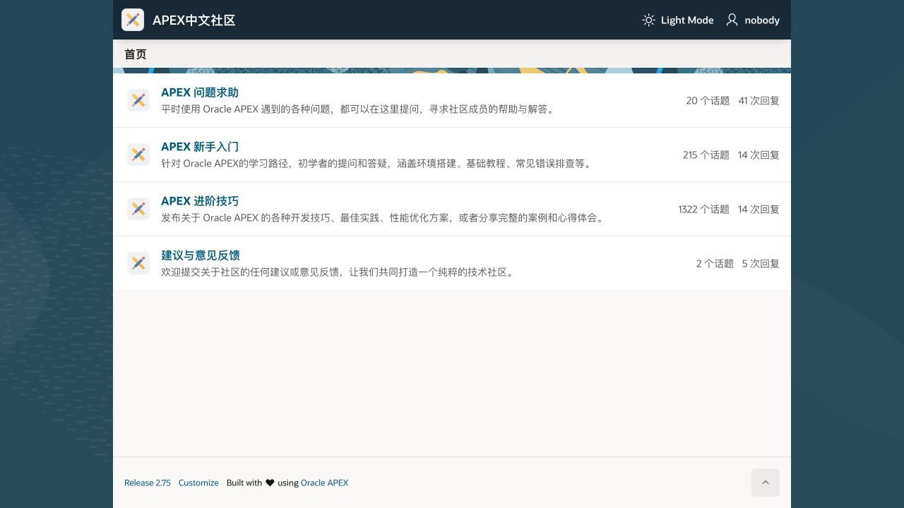
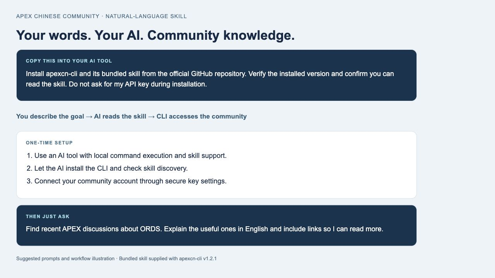
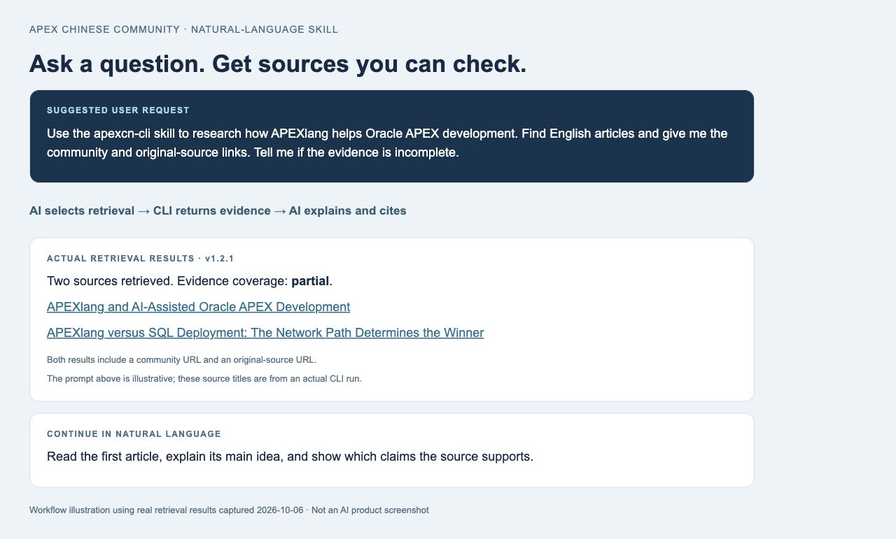

# apexcn-cli

**English** | [简体中文](README.zh-CN.md)

Use the [APEX Chinese Community](https://oracleapex.cn/) through natural conversation with your AI assistant. The included **apexcn-cli skill** teaches your assistant how to search, read, cite, and participate through the CLI. Find Oracle APEX discussions, read available English article editions, and turn community knowledge into answers with sources you can check.

[Get started](#get-started) · [Examples](#put-it-to-work) · [Language support](#chinese-and-english-content) · [English user guide](docs/user-guide.en.md) · [Command reference](docs/cli-manual.en.md)

## Meet the APEX Chinese Community

The APEX Chinese Community at **oracleapex.cn** is a community resource for Oracle APEX developers. It brings together questions and answers, beginner tutorials, development techniques, practical experiences, and collected articles with links to their original sources.

You can browse and participate on the website, or use `apexcn-cli` to bring that material into your development workflow. Developers outside the Chinese-speaking community can search in English, request available English article editions, and ask an AI assistant to explain relevant discussions in their preferred language.

The community and CLI are community projects, not official Oracle products. Content language varies: articles may have Chinese and English editions, while ordinary posts and replies retain the author's original text. See [language support](#chinese-and-english-content) before you start.



## Why use the CLI?

| What you want to do | How apexcn-cli helps |
| --- | --- |
| Solve an APEX or ORDS problem | Search discussions, read details, and retrieve evidence for an AI-assisted explanation. |
| Keep up with community activity | Browse recently updated topics and ask your assistant for a reading digest. |
| Check an answer's sources | Open the community topic and, for collected articles, the original source when available. |
| Reuse useful discussions | Search your own created, replied-to, favorited, or subscribed content. |
| Join a discussion | Draft a question or reply, review a preview, then confirm the action. |
| Build a repeatable workflow | Use structured JSON results in local scripts and AI tools. |

## Get started

The recommended experience is **you describe your goal → your AI uses the skill → the CLI accesses the community → your AI explains the results with sources**. You do not need to learn command names or flags.

Choose an AI tool that can run local commands and load local skills, such as Codex. A browser-only chatbot without local execution cannot use this workflow. Node.js 20 or later is required; installers support macOS, Linux, and Windows.

### 1. Ask your AI to install the CLI and skill

Copy this into a local AI task:

> Install apexcn-cli and its bundled skill from https://github.com/wfg2513148/apexcn-cli using the official installer. Check that the CLI runs and that this AI tool can discover and read the apexcn-cli skill. Tell me the installed version and whether the skill is available. Do not request or display my API key during installation.

The installer copies the [bundled skill](agent-skill/SKILL.md) into supported local skill directories. Skill discovery differs between AI tools: a working CLI alone does not prove the skill is loaded. If necessary, reload the tool's skills or start a new local task, then ask it to verify that it can read the skill. For tools with a custom skill directory, ask the assistant to install the bundled skill in that tool's documented location.

### 2. Connect your community account once

Sign in at [oracleapex.cn](https://oracleapex.cn/), open the account menu, and select **API Key Management** (Chinese label: **API Key 管理**). Copy your key.

If your AI tool provides secure environment settings, save it there as `APEXCN_API_KEY`. Then tell your assistant:

> Configure apexcn-cli to use the existing APEXCN_API_KEY environment variable. Verify community access without displaying the key. Do not copy the secret into chat or a command argument.

If your tool has no secure environment settings, use the one-time terminal setup in the [authentication guide](docs/user-guide.en.md#2-connect-your-api-key). Never paste a key into ordinary AI chat, screenshots, issues, or source control. Browser sign-in and CLI authentication are separate sessions.

### 3. Describe what you need

> Use the apexcn-cli skill to search APEX Chinese Community for ORDS authentication problems. Read the most relevant discussions and explain the solutions in English. Include full topic titles, community links, and original source links where available. Tell me if the evidence is incomplete.

The skill guides your assistant to choose the commands, request the appropriate content language, read the results, and cite sources. Continue naturally:

> Which of those approaches fits my environment? Ask me for any missing version details before recommending one.

For publishing or other community changes, the assistant shows a preview and waits for your confirmation.

## Put it to work

### Research an APEX problem

Ask your assistant:

> Use apexcn-cli to investigate an HTTP 401 when calling a REST API from Oracle APEX. Separate what the community sources establish from your own suggestions. Link each important conclusion to its supporting topic.

### Follow recent activity

> Show topics updated in the last seven days from APEX Chinese Community, using English editions where available. Group them by category and explain which are relevant to an APEX developer working with ORDS.

Your assistant handles the date window and retrieves the matching topics through the skill.

### Build a personal reading list

> Search only my favorites and subscriptions for ORDS. Suggest which discussions I should revisit and preserve their community links.

### Contribute your experience

> Search for similar discussions, then draft a support topic about my APEX REST call returning HTTP 401. Include my environment, reproduction steps, expected result, actual result, and attempted fixes. Show me the draft before publishing.

> Draft a reply to the selected discussion with my test results. Show the target topic and exact reply, and wait for my confirmation.

The write workflow uses a preview followed by explicit confirmation. Publishing, editing, deleting, favoriting, subscribing, and marking an answer require the relevant account permissions. If the target, account, or content changes after preview, preview again.

### See the skill workflow

These English walkthroughs show what to ask your AI and how the skill connects your request to community content. They are documentation illustrations, not screenshots of a particular AI product. The retrieval example uses actual **v1.2.1** results captured on October 6, 2026; the prompt is a suggested user request.





## Chinese and English content

Tell your assistant “Use English editions where available and explain the results in English.” The skill can select the requested content language; you do not need to remember a flag. The underlying behavior is:

- **Searches and questions infer language.** Input containing Han characters, without Japanese kana or Korean Hangul, selects Chinese; other input selects English. Explicit `--lang` overrides this rule.
- **Reads without a query default to Chinese.** Add `--lang en` to category lists, recent topics, and topic-detail reads when you want English.
- **Articles use stored server editions.** If a translation is unavailable, the original may be returned. A stored edition awaiting refresh can be marked `STALE`. Requesting English does not guarantee every result is English.
- **Ordinary posts and replies remain in their original language.** The CLI does not automatically translate them. Ask your local AI for a translation or summary while retaining the original link.
- **The current question controls `ask`.** Previous conversation supplied through `--context` does not change the current question's inferred answer and reference language.
- **Pagination retains language and filters.** Reusing a cursor with another language returns `INVALID_CURSOR_LANGUAGE`. Saved collections retain their requested language when synced.

## Updates and troubleshooting

> Update apexcn-cli to the latest official release. Verify the installed version and check that the bundled skill is still available in this AI tool. Preserve my authentication configuration.

The official updater verifies the downloaded package and keeps a rollback backup. If an older installation cannot update itself, ask your AI to rerun the official installer.

> Check whether the apexcn-cli skill is available, then diagnose the CLI installation, authentication, and community connection. Explain which step failed. Do not display my API key.

If GitHub downloads fail, ask the assistant to check network and proxy settings. Keep TLS verification enabled and use official release URLs. If a key is rejected, obtain a valid key from the community and configure it again; regenerating a key revokes the previous one.

## Optional: use the terminal directly

The CLI also works without an AI tool. Expand this section for manual installation and command examples, or use the [English terminal manual](docs/cli-manual.en.md).

<details>
<summary>Manual installation and CLI examples</summary>

**macOS / Linux:**

```bash
bash -euo pipefail -c 'tmp="$(mktemp)"; trap "rm -f \"$tmp\"" EXIT; curl -fsSL -o "$tmp" https://github.com/wfg2513148/apexcn-cli/releases/latest/download/install-agent.sh; bash "$tmp"'
```

**Windows PowerShell:**

```powershell
irm "https://github.com/wfg2513148/apexcn-cli/releases/latest/download/install-agent.ps1" | iex
```

Configure authentication separately using the [user guide](docs/user-guide.en.md#2-connect-your-api-key), then try:

```bash
apexcn --version
apexcn search "ORDS authentication" --lang en --json
apexcn topic recent --since-hours 168 --page-size 10 --lang en --json
apexcn rag retrieve "How can Oracle APEX call a REST API?" --lang en --json
apexcn update
```

`rag retrieve` returns evidence for your local AI to synthesize. `ask` requests an answer from the community's server-side service; the skill uses it when you explicitly request that service. `auth audit` checks local configuration, while `doctor` also checks community API access.

</details>

## Documentation and feedback

- [English user guide](docs/user-guide.en.md) — natural-language workflows with an AI assistant.
- [English terminal manual](docs/cli-manual.en.md) — commands and options.
- [中文用户手册](docs/user-guide.zh.md) · [中文命令行手册](docs/cli-manual.zh.md).
- [Security model](docs/security-model.md) — authentication and write confirmation details.
- [GitHub Issues](https://github.com/wfg2513148/apexcn-cli/issues) — CLI bugs, documentation improvements, and feature requests in English or Chinese.
- [APEX Chinese Community](https://oracleapex.cn/) — Oracle APEX questions and community discussions.

When reporting a CLI issue, include your operating system, `apexcn --version`, a redacted command, expected behavior, and actual output. Never include an API key or private account data.
